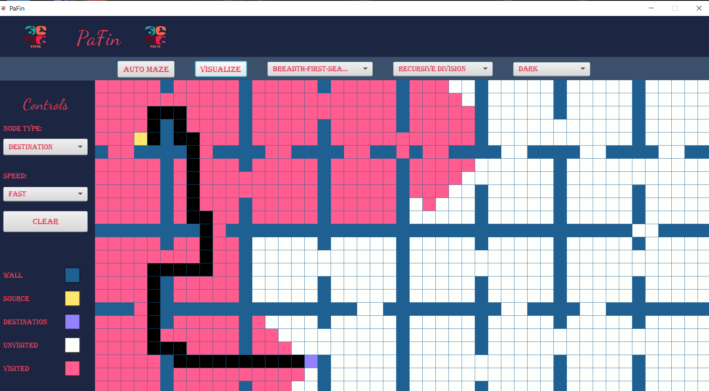

<!-- PROJECT LOGO -->
<br />
<p align="center">

  <h3 align="center">PaFin</h3>
  <p align="center">
    An Awesome Pathfinder Using JavaFX
  </p>
</p>


<!-- TABLE OF CONTENTS -->
<details open="open">
  <summary>Table of Contents</summary>
  <ol>
    <li>
      <a href="#about-the-project">About The Project</a>
      <ul>
        <li><a href="#built-with">Built With</a></li>
      </ul>
    </li>
    <li><a href="#features">Features</a></li>
    <li>
      <a href="#getting-started">Getting Started</a>
      <ul>
        <li><a href="#prerequisites">Prerequisites</a></li>
        <li><a href="#installation">Installation</a></li>
      </ul>
    </li>
    <li><a href="#usage">Usage</a></li>
    <li><a href="#license">License</a></li>
    <li><a href="#contact">Contact</a></li>
  </ol>
</details>


<!-- ABOUT THE PROJECT -->
## About The Project



This is a pathfinding visualizer in a 2-D grid. As a beginner if you fail to grasp the bfs/dfs algorithms, this is for you.The project was implemented using Java and JavaFX. This is my first Java and JavaFX project. 

### Built With

* [JavaFX](https://openjfx.io/)

## Features:
1. Visualize BFS and DFS alogorithms.
2. Find the shortest path using BFS considering all edgeweight same.
3. Generate random mazes and recursion division maze.
4. Press ***d*** for smooth draw mode on and ***Shift + d*** that is ***D*** for smooth draw mode off.
5. Control speed and theme.


<!-- GETTING STARTED -->
## Getting Started

To get a local copy up and running follow these simple example steps.

### Prerequisites

This is an example of how to list things you need to use the software and how to install them.
* JDK
* JavaFX Library
* Intellij IDE

### Installation

1. Download Intellij IDE [Here](https://www.jetbrains.com/idea/download/#section=windows)
2. Download the JDK [Here](https://www.oracle.com/in/java/technologies/javase-downloads.html)
3. Check the installation and version from cmd
  ```sh
  java --version
  ```
4. Download and Follow the instruction for JavaFX library [Here](https://openjfx.io/openjfx-docs/)
5. Create a JavaFX project in Intellij IDE.
6. Download the src folder and replace your project src folder with it. You are done. 


<!-- USAGE EXAMPLES -->
## Usage

PaFin will help to better visualize different pathfinding algorithms for anyone.


<!-- LICENSE -->
## License

Distributed under the MIT License. See `LICENSE` for more information.

<!-- CONTACT -->
## Contact

Asif Azad - brainiac2677@gmail.com

Project Link: [https://github.com/BRAINIAC2677/PaFin](https://github.com/BRAINIAC2677/PaFin)

